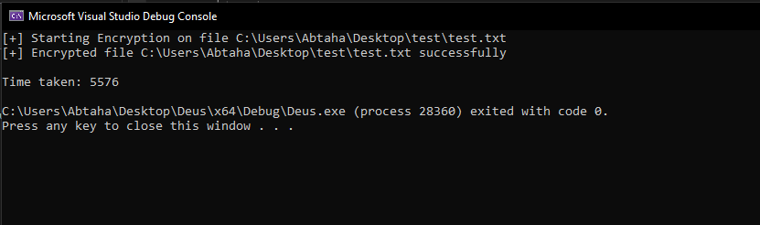
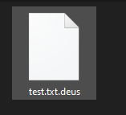

# Deus Ransomware POC

D3US is a POC ransomware I've built in order to explore the Win32 API and the realm of ransomware development.

## Usage

The folder path must be specified when running the program (`Encrypter.exe folderPath`). Deus encrypts all files in the directory recursively.


`Encrypter.exe C:\Users\Abtaha\Desktop\test` 


>

## Method

The crux of the program lies in the Encrypter class which houses functions to encrypt files and folders.

```cpp
class Encrypter {
   public:
    Encrypter();
    ~Encrypter();

    int encryptFile(std::wstring filePath);
    int encryptFolder(std::wstring folderPath);

   private:
    uint8_t m_pubKey[276];

    int preprocessFile(std::wstring filePath, uint64_t* pfileSize, HANDLE* phFile);
    int preprocessEncryption(HCRYPTPROV* phProv, HCRYPTKEY* phKey);
};

```

A public/private key pair is generated before the execution of the program. The public key generated is embedded into the executable inside the `m_pubKey[276]` array. It is stored in a [`PUBLICKEYBLOB`](https://learn.microsoft.com/en-us/openspecs/windows_protocols/ms-mqqb/ade9efde-3ec8-4e47-9ae9-34b64d8081bb) structure which specifies the bit length, public exponent, and modulus of the key.


The main function calls the `encryptFolder` function with the folder path received from the command line as the sole argument. This function loops over all files in the directory and checks whether the file is a folder or not. If so, it recursively calls itself with the updated folder path. Finally, the `encryptFile` function is called to initate the encryption process.

Firstly, for each file a random AES-256 key is generated using the CryptGenKey function and a check on the file extension is performed to check whether or not the file is already encrypted.

> 

> A file encrypted with Deus

The encryption process is essentially a loop which splits the file into chunks. Each chunk consists of 1 MB of data. The encryption is performed on these chunks using CryptEncrypt. The "seek" (pointer) of the file is subtracted by 1 MB to overwrite the cleartext with ciphertext. 

Next, the priavte AES key (the one generated using the CryptGenKey function) is encrypted using the public key generated in the beginning. A 4 byte buffer consisting of four letters, which I'll leave up to you to guess, and the encrypted AES key, which is 268 bytes of data exported using [`SIMPLEBLOB`](https://learn.microsoft.com/en-us/windows/win32/seccrypto/rsa-schannel-key-blobs#simple-key-blobs) data structure:

```
PUBLICKEYSTRUC  publickeystruc
ALG_ID          algid
BYTE            encryptedkey[rsapubkey.bitlen/8]
```

where the PUBLICKEYSTRUC is 

```cpp
struct PUBLICKEYSTRUC {
  BYTE   bType;
  BYTE   bVersion;
  WORD   reserved;
  ALG_ID aiKeyAlg;
}
```

> the ALG_ID is 32 bits or 4 bytes and a WORD is 16 bits or 2 bytes.

This structure allots 268 bytes at the end of the file for the BLOB data, where 12 bytes describe the key and 256 bytes contain the *actual encrypted key*. And yes, I wouldn't call this a 'SIMPLEBLOB' either. 

The final encrypted file contains the following data:

1. Encrypted file data
2. 4 Bytes for the letters **"DEUS"**
3. 268 Bytes for the AES key blob

Finally, The filename is appended with the `.d3us` extension and the encryption process is complete.